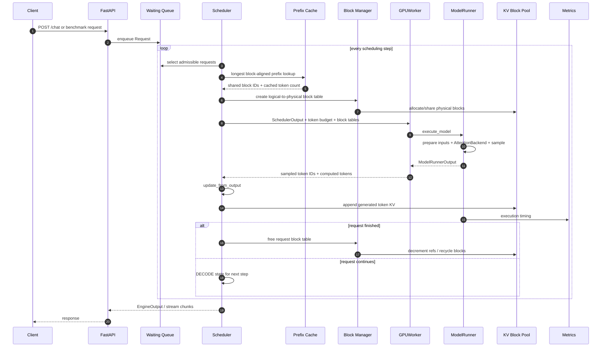
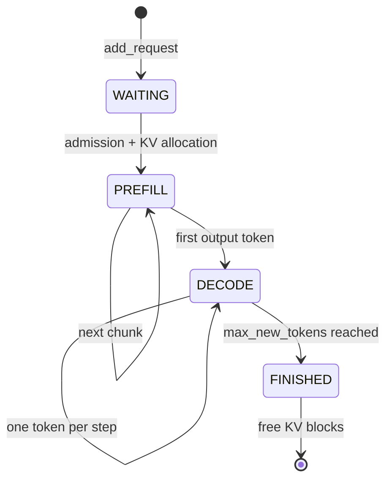

# 完整推理链路与核心数据结构

## 端到端链路



## 请求状态机



## Scheduler 每一步做什么

`Scheduler.schedule()` 的输出是 `SchedulerOutput`，`Batch` 只作为其中便于监控的兼容视图：

```text
free finished requests
        ↓
admission policy (max sequences / memory budget)
        ↓
KV allocation + prefix lookup
        ↓
global token budget + per-request token allocation
        ↓
SchedulerOutput → Worker → ModelRunnerOutput
        ↓
Scheduler.update_from_output
```

这种职责分离允许单独替换 admission policy、ModelRunner、AttentionBackend 或 KV allocator，而不改变主循环。

## Paged KV Cache

假设 block size 为 4 tokens：

```text
Request A tokens:  a0 a1 a2 a3 | a4 a5
Logical blocks:          0      |   1
Block table A:          12      |   7

Physical pool:
block 7  = [a4 a5 __ __] ref=1
block 12 = [a0 a1 a2 a3] ref=2  ← A/B 共享前缀

Request B tokens:  a0 a1 a2 a3 | b4
Logical blocks:          0      |  1
Block table B:          12      | 31
```

逻辑 block 让每条序列看到连续地址；物理 block 可以散布在池中。最后一个 block 的空槽属于内部碎片。block 越小，内部碎片越少，但映射表和 allocator 元数据越多。

## Prefix Cache 命中路径

1. Prompt token IDs 按 block 边界构造 tuple key。
2. 从最长边界向较短边界查找。
3. 验证物理 blocks 仍然有效。
4. 命中 blocks 增加引用计数，新 suffix 分配新 blocks。
5. 请求记录 `cached_prompt_tokens`。
6. ModelRunner 只计算 `prompt_length - cached_prompt_tokens`。
7. Scheduler 接受 sampled token IDs，追加 KV 并判断完成。

当前实现没有 eviction；请求释放后 block 失效，cache entry 在下次查询时惰性清理。这是教学实现与生产 prefix cache 的重要差异。

## 指标时间线

```text
arrival        admitted          first token                    finished
   |--------------|------------------|------------------------------|
   | queue wait   |     prefill      |            decode            |
   |<---------------- TTFT ---------->|                              |
                                      |<-- TPOT between tokens ----->|
   |<----------------------- end-to-end latency -------------------->|
```

- TTFT 同时包含 queue wait 和 prefill。
- TPOT 从首 token 之后计算，避免把 prefill 混入 decode 指标。
- P95 可用于 TTFT、TPOT 或 end-to-end latency，必须说清楚是哪一个分布。
