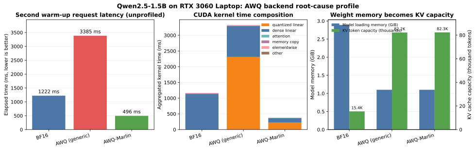

# AWQ backend root-cause profile

This report explains why the original AWQ INT4 run was slower than BF16 and verifies the corrected vLLM backend on the same machine. It is a profiler diagnosis, not a replacement for a repeated end-to-end benchmark.



## Environment

- GPU: NVIDIA GeForce RTX 3060 Laptop GPU, 6 GiB
- Model family: Qwen2.5-1.5B-Instruct
- Runtime: vLLM 0.19.0, PyTorch 2.10.0+cu128
- Compared variants: BF16, AWQ with the generic `awq` backend, and AWQ with `awq_marlin`
- Common server settings: `gpu_memory_utilization=0.65`, `max_model_len=2048`
- Request: 67 prompt tokens and exactly 64 generated tokens, temperature 0
- Procedure: start a clean server, run two warm-up requests, then capture one request with the vLLM PyTorch profiler endpoint

The profiled request reused the same prompt as warm-up. Prefix caching therefore removes most repeated prefill work and makes this trace primarily a decode-path comparison. That is intentional because the original regression was dominated by TPOT/decode.

## Results

| Variant | Second warm-up request | Profiled request | Aggregated CUDA kernel time | Model loading memory | KV cache capacity |
|---|---:|---:|---:|---:|---:|
| BF16 | 1,222 ms | 1,223 ms | 1,168 ms | 2.89 GiB | 15,408 tokens |
| AWQ, generic backend | 3,385 ms | 3,388 ms | 3,328 ms | 1.10 GiB | 82,224 tokens |
| AWQ-Marlin | 496 ms | 696 ms | 380 ms | 1.10 GiB | 82,336 tokens |

The second warm-up request is shown only as a low-overhead sanity check; it is one request rather than a statistically repeated latency benchmark. The profiled-request latency includes profiler overhead, which is especially visible in the AWQ-Marlin run. Kernel composition is the primary evidence from this experiment.

## Root cause

The original server explicitly passed `--quantization awq`. vLLM logged that the model was compatible with AWQ-Marlin but that the explicit setting forced the generic AWQ implementation:

```text
Detected that the model can run with awq_marlin, however you specified
quantization=awq explicitly, so forcing awq. Use quantization=awq_marlin
for faster inference.
```

The generic AWQ trace then showed:

- `vllm::awq::dequantize_weights`: 7,168 calls, 2,310 ms total, 322.3 us per call.
- Dequantization alone consumed 69.4% of all generic-AWQ CUDA kernel time.
- After dequantization, the request still executed FP16 GEMM/GEMV kernels. The reduction in dense-linear time was too small to offset 2.31 seconds of dequantization.
- Attention kernel time was nearly unchanged between BF16 and generic AWQ: 4.15 ms versus 4.05 ms. GPU memcpy time was also nearly unchanged. Neither attention nor transfer was the bottleneck.

With `--quantization awq_marlin`, the dominant quantized matrix kernel became Marlin:

- Marlin core kernel: 7,168 calls, 207.6 ms total, 29.0 us per call.
- The corresponding quantized core was about 11.1 times faster than the generic AWQ dequantization kernel.
- Total CUDA kernel time fell by 88.6% versus generic AWQ and by 67.5% versus BF16 in this decode-focused trace.
- The low-overhead sanity request was 85.3% faster than generic AWQ and 59.4% faster than BF16.

Therefore the original slowdown was not evidence that AWQ inherently fails on small models. The direct cause was a backend-selection error: forcing generic AWQ disabled a compatible fused Marlin path.

## Memory and capacity trade-off

AWQ reduced model loading memory from 2.89 GiB to 1.10 GiB, a 61.9% reduction. Because vLLM was configured with the same 65% GPU-memory budget for every variant, it used the released weight memory for KV cache:

- BF16 KV capacity: 15,408 tokens, estimated maximum concurrency 7.52x at 2,048 tokens/request.
- AWQ-Marlin KV capacity: 82,336 tokens, estimated maximum concurrency 40.20x.
- KV token capacity increased by about 5.34 times.

This is why total `nvidia-smi` memory usage can remain similar after quantization: weight memory falls, but vLLM intentionally expands the KV cache within the fixed memory budget. Weight-only quantization does not directly shrink each token's KV representation.

## Corrected configuration

Use the backend selected for this compatible checkpoint:

```bash
vllm serve /path/to/Qwen2.5-1.5B-Instruct-AWQ \
  --quantization awq_marlin \
  --gpu-memory-utilization 0.65 \
  --max-model-len 2048
```

The project `serve-vllm-awq` and `benchmark-awq` targets now use `awq_marlin` so a normal run does not reproduce the known generic-AWQ regression.

## Reproduce the profile

```bash
python scripts/profile_vllm_quantization.py \
  --bf16-model /path/to/Qwen2.5-1.5B-Instruct \
  --awq-model /path/to/Qwen2.5-1.5B-Instruct-AWQ \
  --vllm-bin /path/to/vllm \
  --output-dir reports/awq_profile_local

python scripts/analyze_vllm_profile.py reports/awq_profile_local
python scripts/plot_awq_profile.py reports/awq_profile_local
```

Raw traces, server logs, and local metadata remain local because they are machine-specific and can contain absolute paths or local service configuration. The repository keeps the summarized CSV, figure, and this report.

## Limitations

- The latency sanity check contains one post-warm-up request per variant; run the repeated GPU benchmark before making a production throughput or P95 claim.
- The trace is decode-focused because the same prompt was warmed and reused. A separate unique-prompt profile is required to study prefill kernels.
- Results are specific to this checkpoint, vLLM version, RTX 3060 Laptop GPU, CUDA/PyTorch stack, and batch shape.
- Higher concurrency can change the relative result. Kernel compatibility and backend selection must be rechecked on each target GPU and vLLM release.
