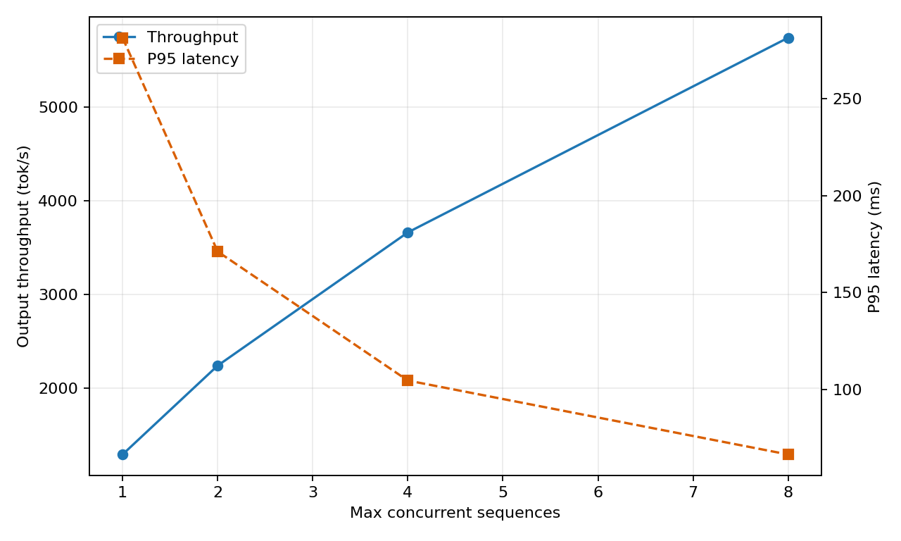
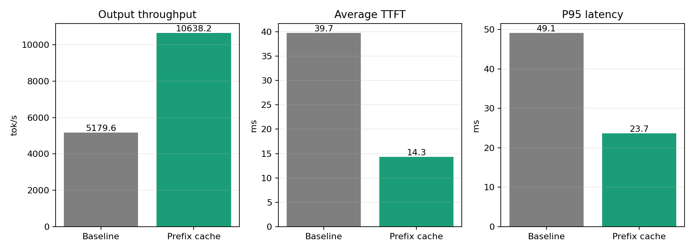
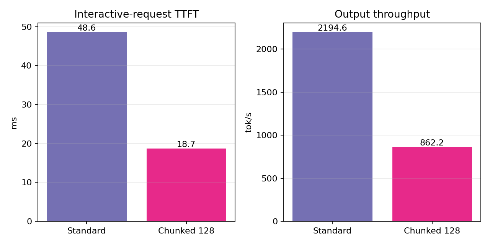
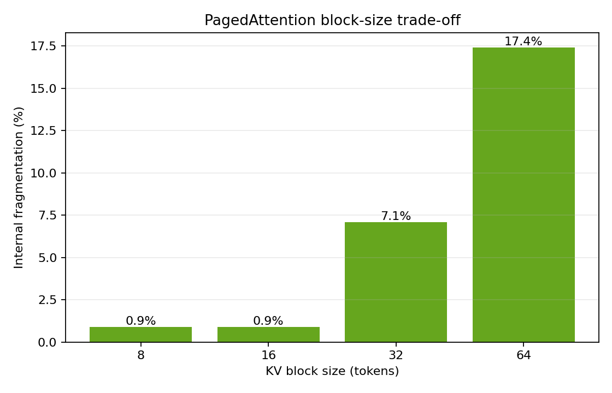

# Benchmark Suite Report

Generated by `python3 -m benchmarks.runner`. Backend: fixed-workload CPU simulation.
These numbers validate project behavior; they are not claims about a production GPU.

## 1. Scheduler concurrency sweep

Concurrency 1 -> 8 changed output throughput from 1290.8 to 5744.5 tok/s, while P95 latency changed from 281.5 to 66.4 ms. In this unsaturated range, larger batches improve GPU-style parallelism and drain the queue faster, so both metrics improve. On a real GPU, P95 normally rises after compute or memory bandwidth saturates.

## 2. Real optimization: prefix-cache compute reuse

The optimized path records block-aligned cache hits in `SchedulerOutput` and lets `ModelRunner` skip those prefill tokens. It reused 1920 prompt tokens. Throughput changed by +105.4%, average TTFT by -63.9%, and P95 latency by -51.7%.

## 3. Chunked prefill

Splitting the long prompt into 128-token chunks changed short-request TTFT by -61.5%. The reason is interleaving: short prefills can finish between long-prompt chunks instead of waiting for one monolithic prefill. Extra scheduling steps may slightly reduce total throughput.

## 4. PagedAttention block size

The smallest tested block size had 0.9% internal fragmentation; the largest had 17.4%. Smaller blocks waste less KV memory and raise concurrency, but increase block-table and allocator metadata overhead.

## Metric interpretation

- **Throughput**: completed output tokens / wall time. Batching typically raises it.
- **TTFT**: arrival to first output token. Prefill compute, queueing, prefix reuse and chunking dominate it.
- **TPOT**: average time between output tokens after the first. Decode batching and memory bandwidth dominate it.
- **P95**: 95% of requests are no slower than this value. It exposes queueing and long-tail prompts hidden by averages.
